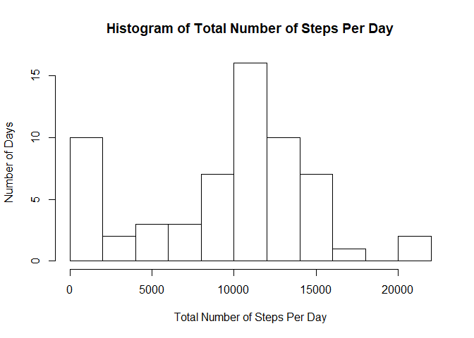
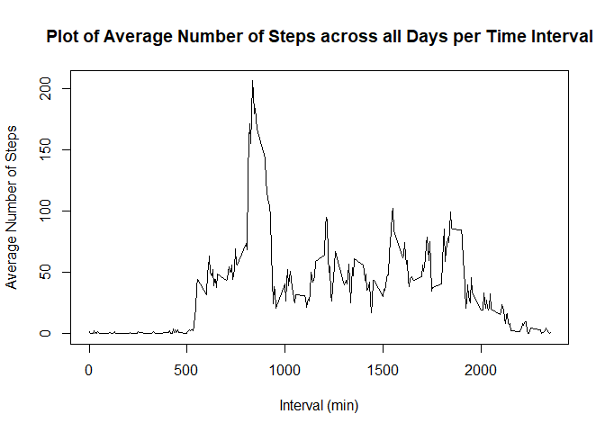
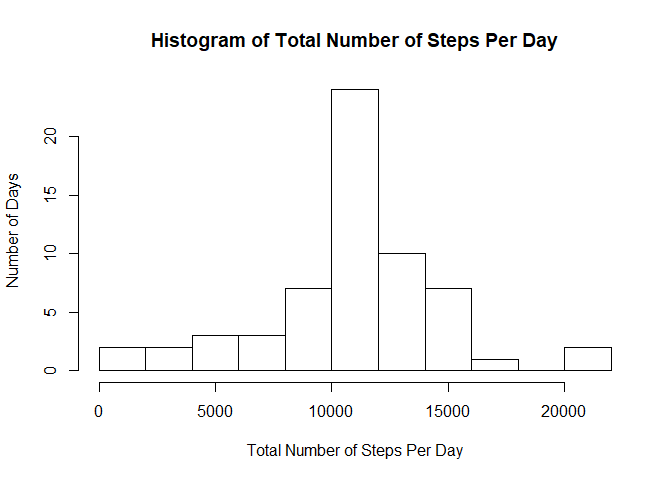
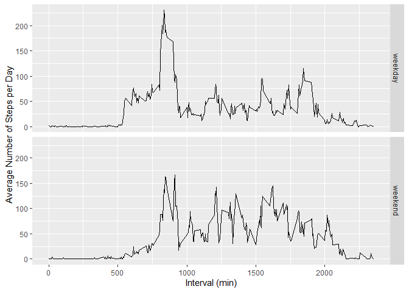

## Loading and preprocessing the data
Load data

```r
data_df <- read.csv(unz("activity.zip", "activity.csv"), header = TRUE,
                    na.strings = "NA")
```

Convert date values from factor to date object in R

```r
data_df <- transform(data_df, date = as.Date(date))
```

## What is mean total number of steps taken per day?
Compute total number of steps taken per day (ignoring NAs)

```r
total_steps_per_day <- tapply(data_df$steps, data_df$date, sum, na.rm = TRUE)
```

Histogram of total number of steps per day

```r
hist(
  total_steps_per_day,
  breaks = 10,
  xlab = "Total Number of Steps Per Day",
  ylab = "Number of Days",
  main = "Histogram of Total Number of Steps Per Day"
)
```

<!-- -->

Mean of total number of steps taken per day

```r
mean(total_steps_per_day, na.rm = TRUE)
```

```
## [1] 9354.23
```

Median of total number of steps taken per day

```r
median(total_steps_per_day, na.rm = TRUE)
```

```
## [1] 10395
```

## What is the average daily activity pattern?
Compute average number of steps for every time interval

```r
ave_steps_per_interval <- tapply(data_df$steps, data_df$interval,
                                 mean, na.rm = TRUE)
```

Time series plot of 5-minute interval and average number of steps taken across all day

```r
plot(names(ave_steps_per_interval), ave_steps_per_interval, type = "l",
     xlab = "Interval (min)", ylab = "Average Number of Steps",
     main = "Plot of Average Number of Steps across all Days per Time Interval")
```

<!-- -->

Get interval which contains the highest number of steps on average across all days

```r
names(which.max(ave_steps_per_interval))
```

```
## [1] "835"
```

## Imputing missing values
Total number of missing values in dataset

```r
sum(is.na(data_df))
```

```
## [1] 2304
```

Impute missing values using average steps per interval

```r
data_imputed <- data_df
for (i in 1:nrow(data_imputed)) {
  if (is.na(data_imputed[i,"steps"])) {
    data_imputed[i,"steps"] <- round(
      ave_steps_per_interval[as.character(data_imputed[i,"interval"])],
      digits = 0
    )
  }
}
```

Histogram of total number of steps per day, using imputed data

```r
total_steps_per_day <- tapply(
  data_imputed$steps, data_imputed$date, sum, na.rm = TRUE
)
hist(
  total_steps_per_day,
  breaks = 10,
  xlab = "Total Number of Steps Per Day",
  ylab = "Number of Days",
  main = "Histogram of Total Number of Steps Per Day"
)
```

<!-- -->

Mean of total number of steps taken per day

```r
mean(total_steps_per_day, na.rm = TRUE)
```

```
## [1] 10765.64
```

Median of total number of steps taken per day

```r
median(total_steps_per_day, na.rm = TRUE)
```

```
## [1] 10762
```

With imputed data, left tail of histogram is reduced, while the frequency in the middle (around the 10,000 mark) is higher. Mean and median are also higher for imputed data compared to original data.

## Are there differences in activity patterns between weekdays and weekends?

Compute day type (weekday or weekend) and add to imputed data as factor variable

```r
is_weekend <- weekdays(data_imputed$date) %in% c("Saturday", "Sunday")
day_type <- vector("character")
for (i in 1:length(is_weekend)) {
  if (is_weekend[i]) {
    day_type <- c(day_type, "weekend")
  }
  else {
    day_type <- c(day_type, "weekday")
  }
}
data_imputed$day_type <- as.factor(day_type)
```

Panel plot of time series of 5-min interval and average number of steps taken, across weekday days and weekend days

```r
library(ggplot2)
ggplot(data = data_imputed) +
  stat_summary(aes(x = interval, y = steps), fun.y = mean, geom = "line") +
  facet_grid(day_type ~ .) +
  labs(x = "Interval (min)", y = "Average Number of Steps per Day")
```

<!-- -->

